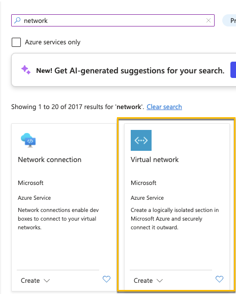
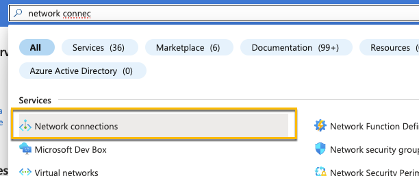

# Task 01 - Deploy the necessary prerequisites required for a Microsoft Dev Box (20 minutes)

1. Navigate to Azure and create a new Resource Group for the Lab
2. In the search box, find Microsoft Dev Box

   
3. Select Dev centers and click to create a new one
4. Use a name like MPPDevCenter for the Dev center name
   
5. Once you're in your Dev Center, Create a new project
   
6. Create a project for the Munson's Pickles and Preserves Team Messaging System application
7. 
   1. Leave Dev Box management with the defaults, if you wanted to set a limit on the number of dev boxes a user could create you can do that here.
8. Go back to the Azure Portal and your Resource Group and create a new Virtual network
    
    
    You can keep Security and IP addresses to the defaults and create the network
9. Create a new Network Connection in the resource group
    
10. Make sure it's in your same resource group and the domain join type is set to Azure active directory join. In the network connection details connect it to the network you just created.
    
11. Once the network connection is created, navigate back to your Dev Center and under Networking add the network connection you just created.
    
    You can add it before the checks are finished running, they will continue to run once it's been added.

Now you're ready to start creating a custom image to deploy your Dev Box.