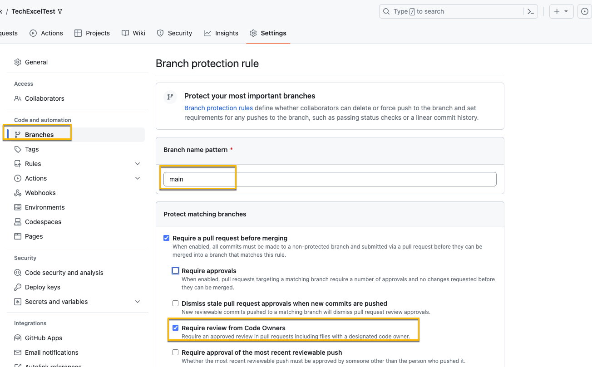
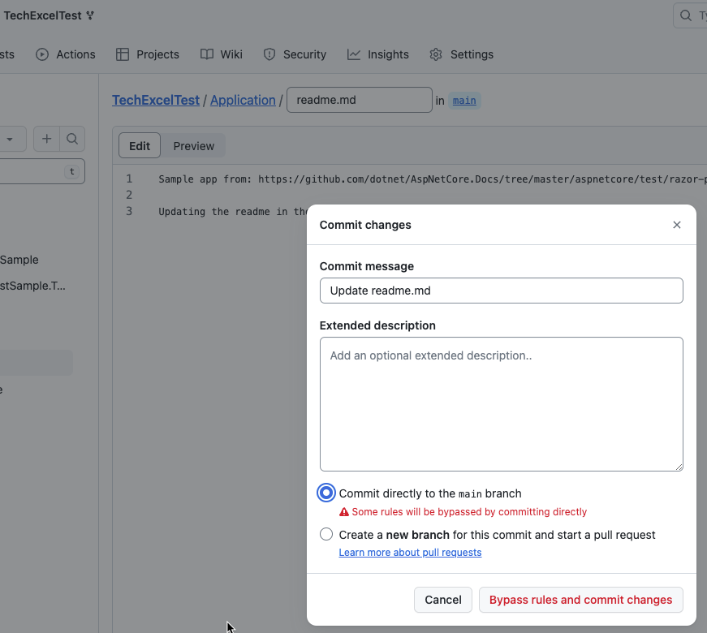
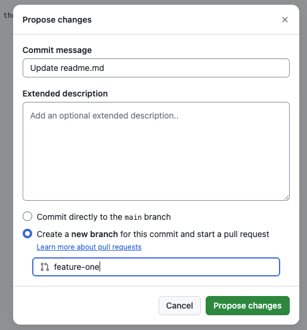
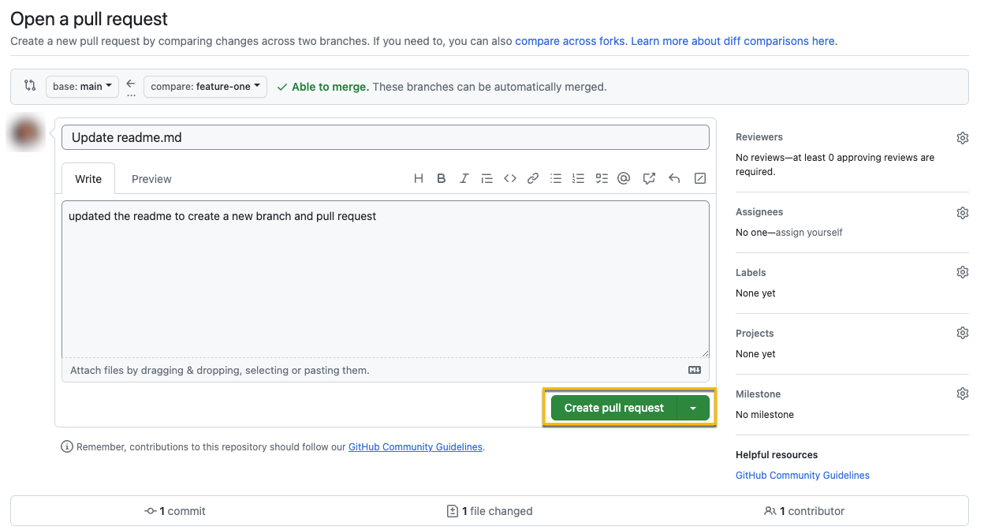
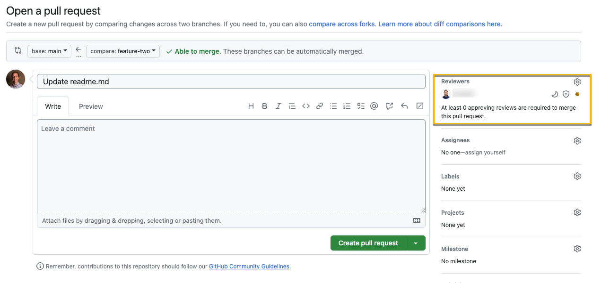
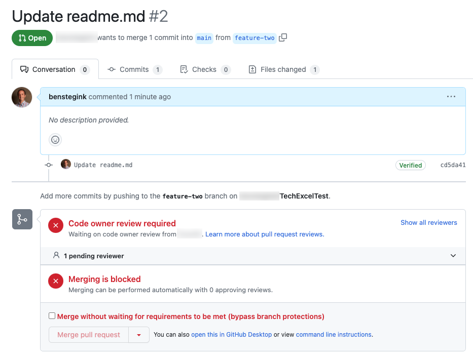

# Task 01 - Branching & Policies (20 minutes)

1. Go to Settings, Branches, and select Add branch protection rule
   
2. For the branch name pattern use `main`. If you wanted this to apply to a certain name format you could also use a regex pattern.
3. Ensure that Require a pull request before merging is checked
    - Keep require approvals check and the number of approvals to 1
    - Select Require review from Code Owners
    
4. Add the CODEOWNERS file to specify the code owners for the repo and applications
    
5. Testing the branch protection rules is hard if it is your personal repo and you are the Owner as Owners can bypass the branch protection rule. One way to verify the rule is properly in place it to edit the file in the browser and then commit the change and select the main branch. If the rule is in place, you'll get a warning about bypassing the rules and committing the change.
    
6. If you select to create a new branch, the warning will be removed and you can propose the change.
    
7. Once you've proposed the change in a new branch, you can create the pull request to merge the branch into main. Similar to committing to main, if you're doing this on your own repo, their isn't a review that happens since you can be your own approver. To test this, set the approver to another GitHub account or find someone to partner up with you so you test this out.
    
    The screen shot below shows what happens if you are your own approver. You'll see there is nothing in the reviewers.
    
    This screen demonstrate what happens when you set the code owner to someone else. That person will show up under the reviewers.
     - Crescent Moon: *username* will be requested when the pull request is marked ready for review
     - Shield: *username* is a code owner
     - Dot: Awaiting requested review from *username*
    
8. When you try to create the PR, you'll have errors about waiting for the code owner review. Since you are an admin of the repo, you can bypass the owner review branch protection, but this is a permission only granted to the admin of the repo.
    
9. Once the pull request has been merged and closed, you can delete the branch
    