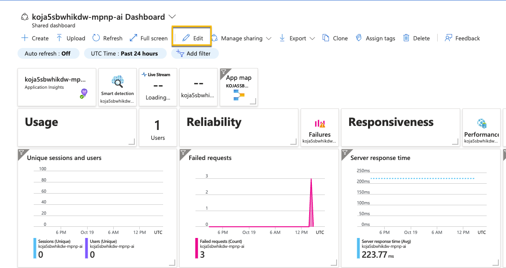
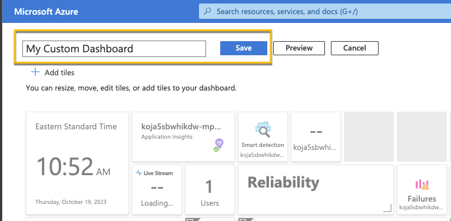
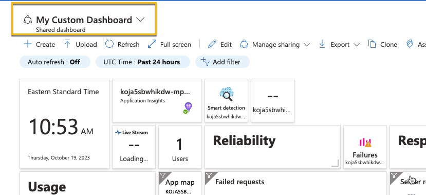
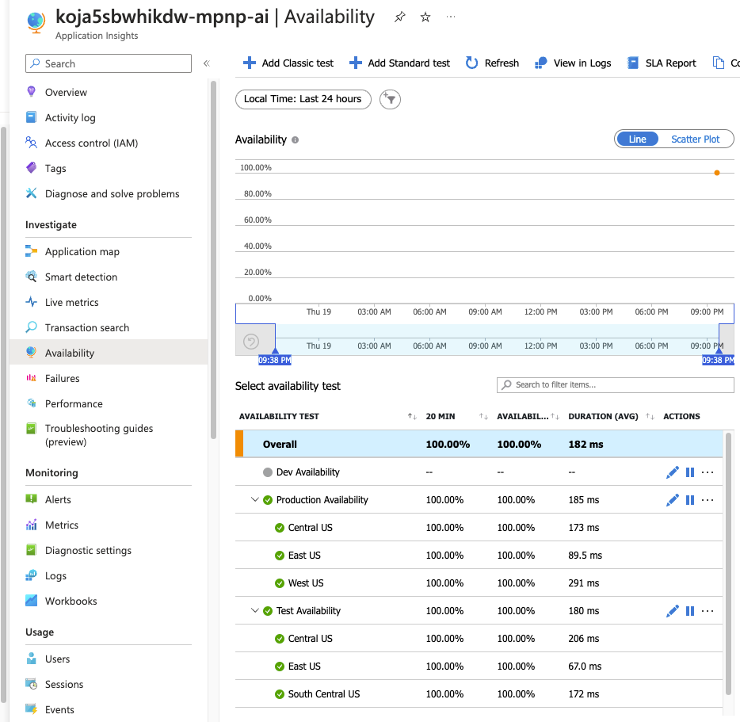
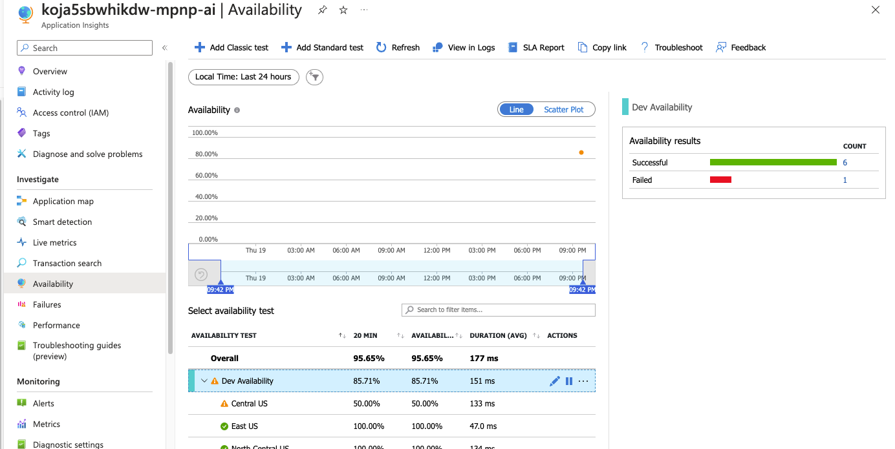
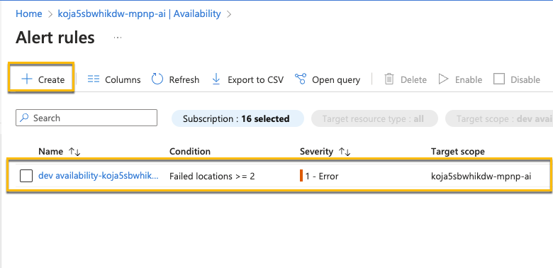

# Task 03 - Monitoring with Application Insights (20 minutes)

1. The App Insights Instrumentation key property is defined here under the appServiceApp resource
   
2. The App Insights resource is deployed here in the .bicep file
   
3. Go to Application Insights and select "Application Dashboard".
   
4. Select "Edit" to explore what kinds of changes and updates you can make to the default dashboard
   
5. After making a few changes, name your new custom dashboard and save it.
   
6. Your new custom dashboard is now selected and is the new default dashboard for App Services.
   
7. Setup a Classic Test for your production site (or any other site)
   
8. This can be repeated for Dev and Test as well.
9. After a few minutes you'll start seeing data coming in.
    
10. To see what happens when an app in unavailable, you can turn of one of your apps.
    
11. If you want alerts based on the site availability, select the ellipsis by the test and select "Open rules (Alerts) page".
    
12. There will be a default alert created for failed applications. You can also select "+ Create" if you want add additional rules.
    
13. If you want to explore creating additional alerts, feel free. But nothing else needs to be created.