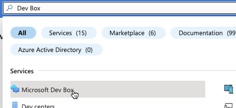
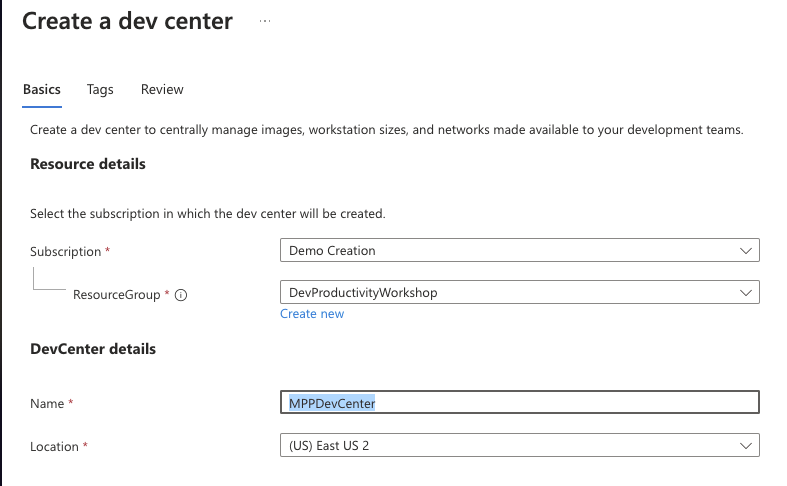
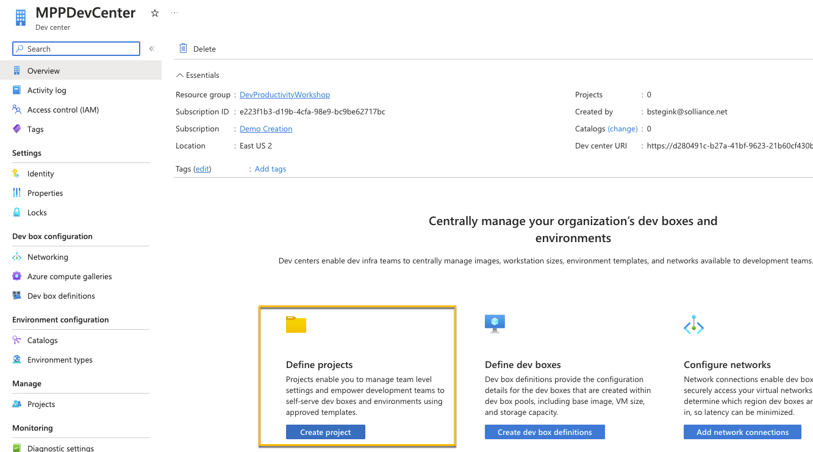
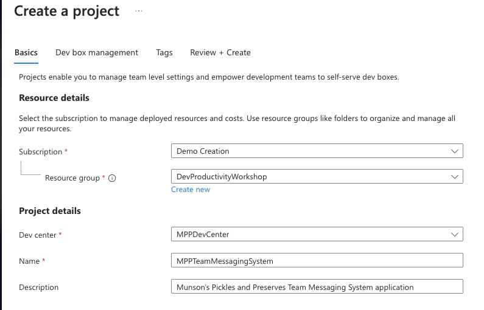
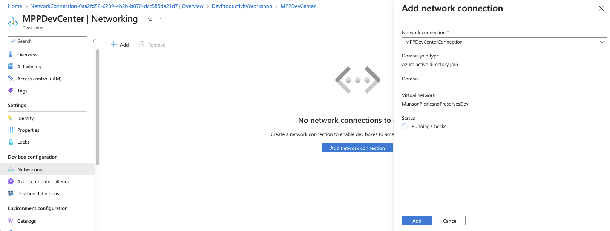
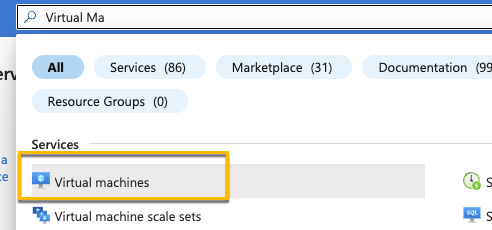
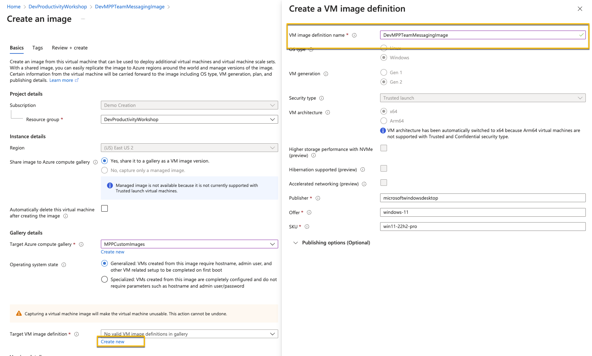
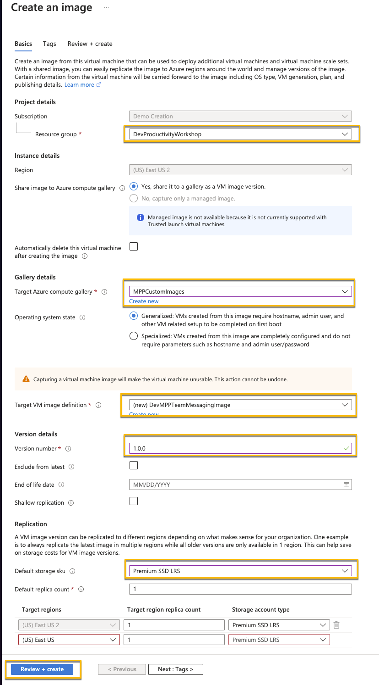
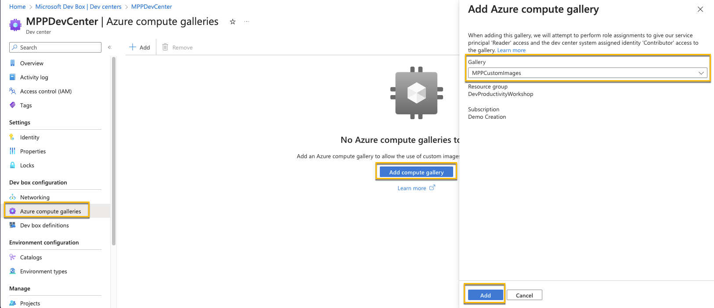
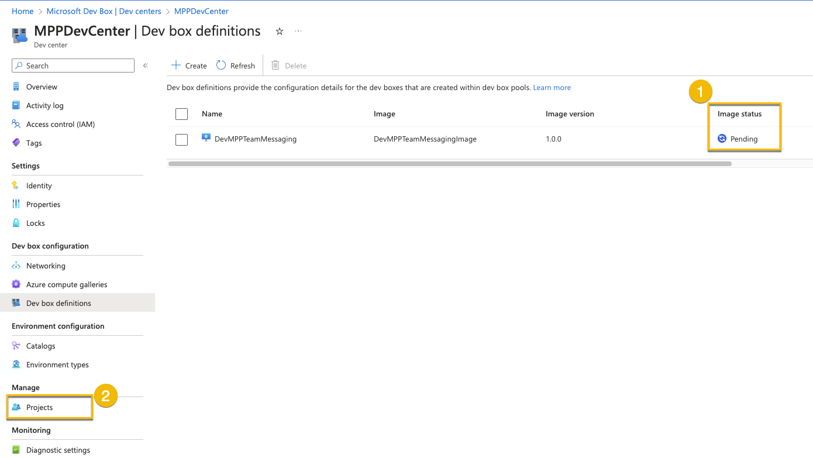

# Exercise 01 - Set up development environment

## Task 1 - Deploy the necessary prerequisites required for a Microsoft Dev Box

1. Navigate to Azure and create a new Resource Group for the Lab
2. In the search box, find Microsoft Dev Box
    
3. Select Dev centers and click to create a new one
4. Use a name like MPPDevCenter for the Dev center name
   
5. Once you're in your Dev Center, Create a new project
   
6. Create a project for the Munson's Pickles and Preserves Team Messaging System application
7. 
   1. Leave Dev Box management with the defaults, if you wanted to set a limit on the number of dev boxes a user could create you can do that here.
8. Go back to the Azure Portal and your Resource Group and create a new Virtual network
    
    
    You can keep Security and IP addresses to the defaults and create the network
9. Create a new Network Connection in the resource group
    
10. Make sure it's in your same resource group and the domain join type is set to Azure active directory join. In the network connection details connect it to the network you just created.
    
11. Once the network connection is created, navigate back to your Dev Center and under Networking add the network connection you just created.
    
    You can add it before the checks are finished running, they will continue to run once it's been added.

Now you're ready to start creating a custom image to deploy your Dev Box.

## Task 2 - Setup an image

1. In the Azure Portal create a new Azure Compute Gallery
   
2. Configure the following properties. On the Sharing Tab you can keep the defaults. Create the Gallery.
   
3. Now creating a Windows 11 VM
4. 
5. For the settings
    - Basics:
      - Same Resource Group you've been using
      - Virtual Machine name: DevMPPTeamMessagingImage
      - Availability options: No infrastructure redundancy required
      - Security type: Trusted launch virtual machines
      - Images: Windows 11 Enterprise, version 22H2 - x64 Gen2
        - **Note: Make sure you select enterprise and not pro. Pro is not supported for Dev Box.** 
      - Size: Standard_D4s_v5
      - Username: DevBoxAdmin
      - Password: something you'll remember
      - Licensing: Confirm
        
    - Disks:
      - Do nothing
    - Networking:
      - Make sure it's connected to the network you created in the last task
      - Check "Delete public IP and NIC when a VM is deleted":
      - Uncheck "Enable accelerated network"
        
    - Management, Monitoring, Advanced
      - Do nothing and take the defaults
    - Create the VM
6. Configure the network to only allow RDP access form you IP address
    - Under the VM Network settings click RDP in the Network Security Group. Set Source to "My IP address" and select Save
    
7. RDP Into the box and download/install the software.
   1. These are all pretty straight forward, just make sure they all get installed for all users
   2. Before running sysprep, shut down the VM and take a snapshot. Once you perform a sysprep you can't start the VM back up again without using this snapshot.
   3. An error with Docker after the install is fine, just ignore it and do the sysprep
8. After the Windows machine shuts down due to sysprep, navigate to your virtual machine in Azure.
9. Select Capture
    
10. Select the Azure computer gallery you created in Task 1
    
11. Create a new Target VM image definition
    
12. Set the Version number to 1.0.0
13. Set Default storage sku to Premium SSD LRS
14. The configuration should look like this. Then create the image
    
    -**Note**: This step can take a little bit to complete

## Task 3 - Deploy a Microsoft Dev Box

1. Navigate back to your Dev Center, go to Identity and turn on a system assigned Managed Identity
   
2. Once it's been abled, in the Dev Center and add the compute gallery that was created in Task 2
   
3. Go to you Dev box definitions, and create a new definition. Use the image you created in Task 2
   
4. After the definition has been created and the image status verified, go to Projects and open up your MPPTeamMessagingSystem Project
   
5. Navigate to Manage dev box pools, and create a dev box pool
   
6. Configure the settings as seen below. Use your Dev Box Image you just created as well as the network connection you created in Task 1. You may also want to adjust the auto-stop time
   
7. Finally, for the Project, under Access control, assign yourself and any other users to be a "DevCenter Dev Box Users"
    

**Notes:** At this point in time, Docker doesn't appear to work if it was installed on the image and may need an uninstall/re-install