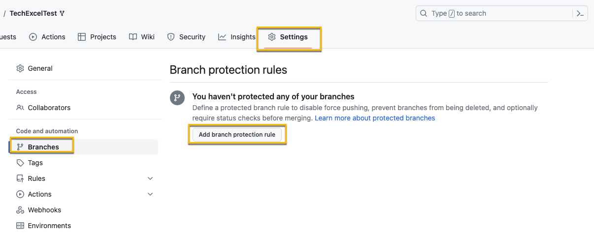
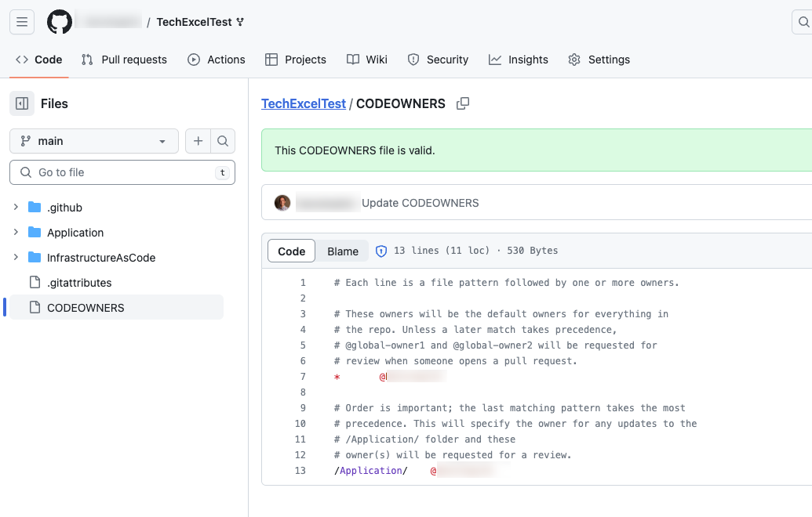
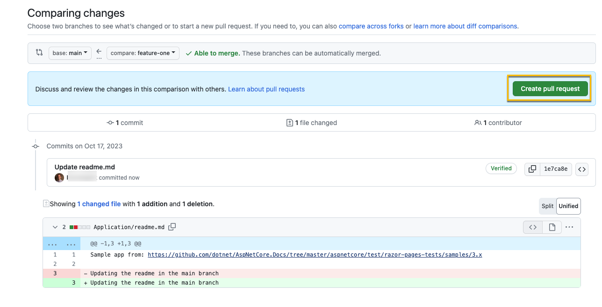
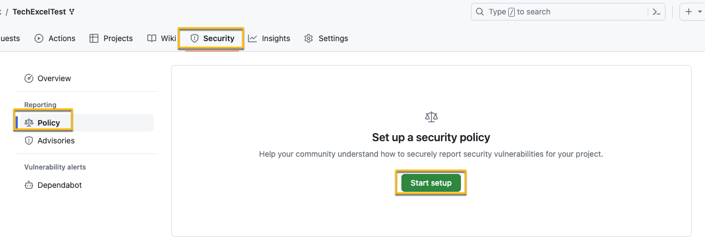
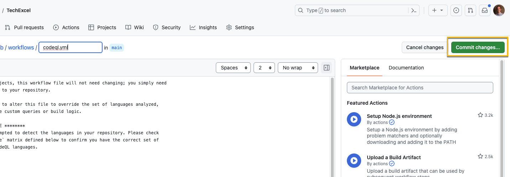
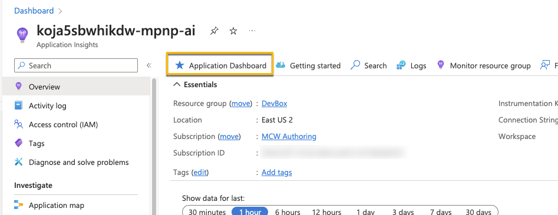
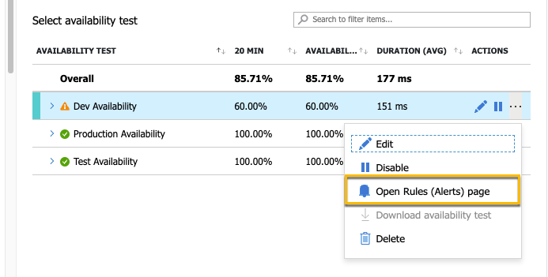

# Exercise 05 - Make things secure

## Task 1 - Branching & Policies

### Creating a branch protection rule

1. Go to Settings, Branches, and select Add branch protection rule
   
2. For the branch name pattern use `main`. If you wanted this to apply to a certain name format you could also use a regex pattern.
3. Ensure that Require a pull request before merging is checked
    - Keep require approvals check and the number of approvals to 1
    - Select Require review from Code Owners
    
4. Add the CODEOWNERS file to specify the code owners for the repo and applications
    
5. Testing the branch protection rules is hard if it is your personal repo and you are the Owner as Owners can bypass the branch protection rule. One way to verify the rule is properly in place it to edit the file in the browser and then commit the change and select the main branch. If the rule is in place, you'll get a warning about bypassing the rules and committing the change.
    
6. If you select to create a new branch, the warning will be removed and you can propose the change.
    
7. Once you've proposed the change in a new branch, you can create the pull request to merge the branch into main. Similar to committing to main, if you're doing this on your own repo, their isn't a review that happens since you can be your own approver. To test this, set the approver to another GitHub account or find someone to partner up with you so you test this out.
    
    The screen shot below shows what happens if you are your own approver. You'll see there is nothing in the reviewers.
    
    This screen demonstrate what happens when you set the code owner to someone else. That person will show up under the reviewers.
     - Crescent Moon: *username* will be requested when the pull request is marked ready for review
     - Shield: *username* is a code owner
     - Dot: Awaiting requested review from *username*
    
8. When you try to create the PR, you'll have errors about waiting for the code owner review. Since you are an admin of the repo, you can bypass the owner review branch protection, but this is a permission only granted to the admin of the repo.
    
9. Once the pull request has been merged and closed, you can delete the branch
    

## Task 2 - Security

1. Select settings in your repo, then "Code security and analysis". Select "Enable" on "Dependabot alerts" and "Dependabot security updates".
    
    **Note** This will also automatically turn on Dependency graph
2. Navigate to for information about security policies. It also has a link to a sample security policy that should be used for this exercise - [https://github.com/electron/electron/blob/main/SECURITY.md](https://github.com/electron/electron/blob/main/SECURITY.md)
3. In your GitHub repot, select Security, Policy, and Start setup
   
4. Paste the security policy into the Markdown file (you can overwrite what is there now) and update it for the Munson's Pickles and Preserves Teams Messaging System and the GitHub repot your code is in, then commit the changes to the main branch.
   
5. Next we need to enable CodeQL. Select Settings and then Code security and analysis.
6. Scroll down if needed and select Set up in Code scanning for CodeQL analysis.
    
7. If you select "Default", the code scan will immediately be run. For this exercise, select Advanced.
    
8. By choosing the advanced option, you can see the YAML for the pipeline that actually performs the code check. We don't need to make any changes here, but it's something you should be familiar with. Any easy change to make in this file would be if you want to adjust the schedule of when the scan runs. After you're reviewed the YAML, Commit the change to main.
    
    
9. After you've committed the change, select Actions and you should see your CodeQL Scan workflow running.
    
10. After about 5 minutes, you should see the workflow has completed.
    
11. After it's complete, go back to "Settings" and "Code security and analysis". Then click the ellipsis (...) to "Set up". You'll see a couple of options there, "View last scan log, and "View Code Scanning alerts". Click and those just to explore. You shouldn't see much in either screen. The final option, "View CodeQL Workflow" will take you to the YAML file you created in step 9. **Note:** it will still say "Set up" since we chose the Advanced option instead of Basic.
    

## Task 3

1. The App Insights Instrumentation key property is defined here under the appServiceApp resource
   
2. The App Insights resource is deployed here in the .bicep file
   
3. Go to Application Insights and select "Application Dashboard".
   
4. Select "Edit" to explore what kinds of changes and updates you can make to the default dashboard
   
5. After making a few changes, name your new custom dashboard and save it.
   
6. Your new custom dashboard is now selected and is the new default dashboard for App Services.
   
7. Setup a Classic Test for your production site (or any other site)
   
8. This can be repeated for Dev and Test as well.
9. After a few minutes you'll start seeing data coming in.
    
10. To see what happens when an app in unavailable, you can turn of one of your apps.
    
11. If you want alerts based on the site availability, select the ellipsis by the test and select "Open rules (Alerts) page".
    
12. There will be a default alert created for failed applications. You can also select "+ Create" if you want add additional rules.
    
13. If you want to explore creating additional alerts, feel free. But nothing else needs to be created.