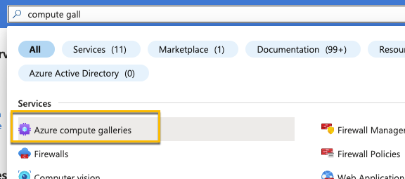
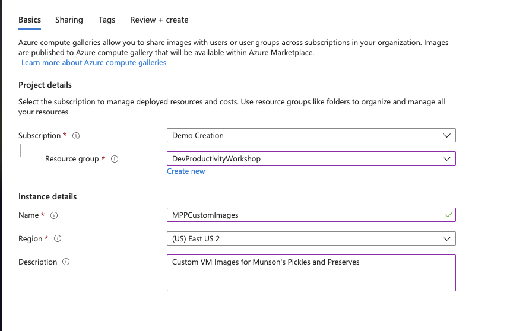
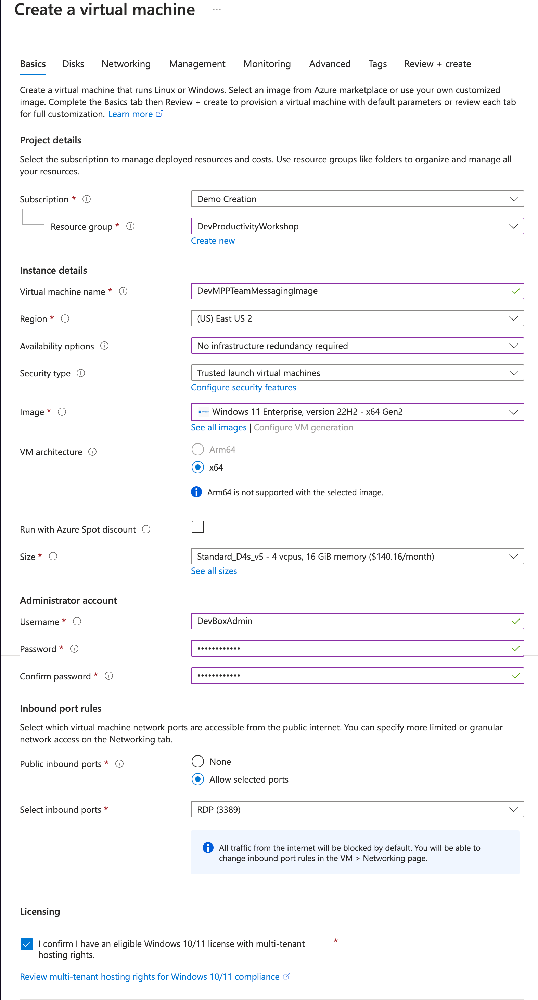

# Task 02 - Setup an image (90 minutes)

## Description

Typically, when a developer needs to have an environment configured for their development tasks, they need software deployed, specific versions of tools and source code, any other configurations for their development tasks. This can be a time-consuming process, particularly when onboarding a new developer or switching to a new development project.

If developers are working on multiple projects, they may even have challenges with those different projects requiring different versions of the same software. In this task, you'll setup a Dev Box definition using a standard Windows Image. However, using Dev Box a custom image could also be created that enables software and settings to be preconfigured so as soon as a user is onboarded or needs to work on a different project, an environment can be quickly spun up for them from an image.

If you do want to try to create a custom image, look for the stretch goal solution sections within Exercise 1.

1. Create a compute gallery & add it to the Dev center
2. Create a custom image using Windows 11 Enterprise, version 22H2 - x64 Gen2

   {: .note }
   > Make sure you select enterprise and not pro. Pro is not supported for Dev Box.

3. Include the following software on the custom image. If you have any issues selecting and copying the link you can also right click the link and select "Copy Link".
4. Before running sysprep, shut down the VM and take a snapshot. Before running sysprep, shut down the VM and take a snapshot. Once you have a snapshot, boot the VM back up, login and run sysprep on the VM. Once you perform a sysprep you can't start the VM back up again without using this snapshot. Once you perform a sysprep you can't start the VM back up again without using this snapshot.
5. Perform sysprep. To do so:
   - Delete C:\Windows\Panther and empty the recycle bin
   - In the command prompt, CD to C:\Windows\System32\SysPrep and run `sysprep.exe /oobe /generalize /shutdown`
6. Create the new image
   - For the VM image definition, create a new one with the name "DevBoxProject" and leave everything else as default
   - VM version number can be 1.0.0
   - Default storage SKU: Premium SD LRS
   - Review + create --> Create
  
{: .important }
> It can take anywhere from 20 minutes to an hour to create the image. If it still hasn't completed after 15 or 20 minutes. You can start on Exercise 2 using a different machine. Task 3 of exercise 1 depends on the completely of this image creating.  It is ok to use your own computer for Day 1 and use the Dev Box on day 2.

## Success Criteria

- You have created a compute gallery and added it to the Dev center.
- You have created a custom image with all relevant software installed.

## Learning Resources

- [Create an Azure Compute gallery](https://learn.microsoft.com/azure/virtual-machines/create-gallery?tabs=portal%2Cportaldirect%2Ccli2)
- [Create a Dev Box Definition](https://learn.microsoft.com/azure/dev-box/quickstart-configure-dev-box-service?tabs=AzureADJoin#3-create-a-dev-box-definition)
- [Generalize a VM](https://learn.microsoft.com/azure/virtual-machines/generalize)
- [Create an image from a VM](https://learn.microsoft.com/azure/virtual-machines/capture-image-portal)

## Tips

- For the image creation, use the VM Size: Standard D4s v3 (4 vCPUs, 16 GiB memory) with a Windows 10 or 11 Image
- After running sysprep on a virtual machine in Azure, you can't use it again, so you can delete the VM along with it's associated resources (NIC, Disk, etc.)
- For security, once you create the VM with RDP access, go into the networking settings and set the RDP access Source to be limited to your IP address
- If you do need to make changes to your VM after you ran sysprep, you'll need to restore from the snapshot
    1. Create a new disk from the snapshot
    2. Create a new VM from the new managed disk
    3. Make your updates on the VM
    4. Create a new snapshot
    5. Run sysprep again.

## Solution

Expand this section to view the solution to create your own custom image.

1. In the Azure Portal create a new Azure Compute Gallery
   
2. Configure the following properties. On the Sharing Tab you can keep the defaults. Create the Gallery.
   
3. Now creating a Windows 11 VM
   
4. For the settings
    - Basics:
      - Same Resource Group you've been using
      - Virtual Machine name: DevMPPTeamMessagingImage
      - Availability options: No infrastructure redundancy required
      - Security type: Trusted launch virtual machines
      - Images: Windows 11 Enterprise, version 22H2 - x64 Gen2
        - **Note: Make sure you select enterprise and not pro. Pro is not supported for Dev Box.** 
      - Size: Standard_D4s_v5
      - Username: DevBoxAdmin
      - Password: something you'll remember
      - Licensing: Confirm
        
    - Disks:
      - Do nothing
    - Networking:
      - Make sure it's connected to the network you created in the last task
      - Check "Delete public IP and NIC when a VM is deleted":
      - Uncheck "Enable accelerated network"
        
    - Management, Monitoring, Advanced
      - Do nothing and take the defaults
    - Create the VM
5. Configure the network to only allow RDP access form you IP address
    - Under the VM Network settings click RDP in the Network Security Group. Set Source to "My IP address" and select Save
    
6. RDP Into the box and download/install the following software. When you install the software, if the option is availbe, make sure to select **Install for all users**:
    - Visual Studio Code (System Installer):
      - [https://code.visualstudio.com/Download](https://code.visualstudio.com/Download)
      - Make sure this finishes before installing Git so you can set it as the default editor
    - Java (for JMeter):
      - [https://www.java.com/en/download/](https://www.java.com/en/download/)
    - Apache JMeter:
      - [https://dlcdn.apache.org//jmeter/binaries/apache-jmeter-5.6.2.zip](https://dlcdn.apache.org//jmeter/binaries/apache-jmeter-5.6.2.zip)
      - Extract the apache-jmeter-5.6.2 folder to C:\
    - Azure Storage Explorer (Install for all users):
      - [https://azure.microsoft.com/products/storage/storage-explorer/](https://azure.microsoft.com/products/storage/storage-explorer/)
    - Git bash:
      - [https://git-scm.com/download/win](https://git-scm.com/download/win)
      - 64bit git for Windows Setup
      - You may want to set the default editor to VSCode, keep the defaults for everything else.
    - .NET SDK 6.0 LTS:
      - [https://dotnet.microsoft.com/download/visual-studio-sdks](https://dotnet.microsoft.com/download/visual-studio-sdks)
      - .NET 6.0 x64 Visual Studio 2022 SDK
    - Firefox:
      - [https://www.mozilla.org/en-US/firefox/new/](https://www.mozilla.org/en-US/firefox/new/).
      - Firefox is useful because it allows you to create a manual proxy rather than using Windows defaults, as Chrome and Edge require. This will be helpful in Exercise 4.

    {: .important }
    > Before running sysprep, shut down the VM and take a snapshot. Once you have a snapshot, boot the VM back up, login and run sysprep on the VM. Once you perform a sysprep you can't start the VM back up again without using this snapshot.
7. Perform sysprep. To do so:
   - Delete C:\Windows\Panther and empty the recycle bin
   - In the command prompt, CD to C:\Windows\System32\SysPrep and run `sysprep.exe /oobe /generalize /shutdown`
8. After the Windows machine shuts down due to sysprep, navigate to your virtual machine in Azure.
9. Select Capture
    
10. Select the Azure computer gallery you created in Task 1
    
11. Create a new Target VM image definition
    
12. Set the Version number to 1.0.0
13. Set Default storage SKU to Premium SSD LRS
14. The configuration should look like this. Then create the image
    
    -**Note**: This step can take some time to complete. If it hasn't completely after about 20 minute, students can proceed to Exercise 2 and use their own machines. They can check on that status periodically, and once it completes, move on to Task 3. It's OK to use their own machine for Day 1 and use the Dev Box on day 2.

