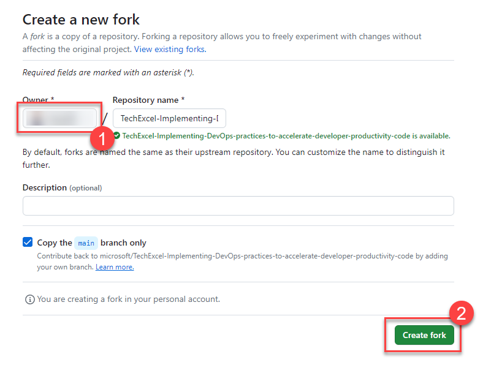

# Task 01 - Set up a GitHub repository (10 minutes)

## Introduction

Version control is typically one of the first components that teams implement as they start on projects. Version control is also one of the oldest and most well understood components of DevOps. Version control systems allow developers to collaborate and simultaneously contribute to the same codebase. They can also help teams track versions--so code can be rolled back if bad changes are made--as well as bugs, work items, and test results. If necessary, please take a moment to review the [Git handbook](https://guides.github.com/introduction/git-handbook/) to understand the basics of version control, focusing on the distributed version control technology Git.

## Description

In this task, you will ensure that you have a GitHub repository set up with the Munson's Pickles and Preserves Team Messaging System application code in it. The MP&P development team has provided us a simple version of an internal messaging system they use. This .NET 6 application is the one they would like to use for a DevOps proof of concept. They have also provided a Bicep template for creating Azure resources.

The key tasks are as follows:

1. Fork [the starter GitHub repository](https://github.com/microsoft/TechExcel-Implementing-DevOps-practices-to-accelerate-developer-productivity-code) to your GitHub account.
2. Clone your new repository to your Dev Box.

## Success Criteria

- You have a repository cloned to your local machine and synchronized with GitHub.com.
- The `Application` and `InfrastructureAsCode` folders are at the root of your repository.

## Learning Resources

- [Forking a GitHub repository](https://docs.github.com/en/pull-requests/collaborating-with-pull-requests/working-with-forks/fork-a-repo)
- Cloning a repository via the [command line](https://docs.github.com/en/github/creating-cloning-and-archiving-repositories/cloning-a-repository) or [GitHub Desktop](https://docs.github.com/en/desktop/contributing-and-collaborating-using-github-desktop/cloning-a-repository-from-github-to-github-desktop)
  - For those using GitHub Desktop, here is documentation on [committing](https://docs.github.com/en/desktop/contributing-and-collaborating-using-github-desktop/committing-and-reviewing-changes-to-your-project) and [pushing](https://docs.github.com/en/desktop/contributing-and-collaborating-using-github-desktop/pushing-changes-to-github) changes to a repository.
  - If working with the command line, check out these articles on [committing](https://docs.github.com/en/github/committing-changes-to-your-project/creating-and-editing-commits) and [pushing](https://docs.github.com/en/github/using-git/pushing-commits-to-a-remote-repository) changes.
- Additionally, you may need to pull other people's changes into your local repository to stay in sync--see documentation for [command line](https://docs.github.com/en/github/using-git/getting-changes-from-a-remote-repository) and [GitHub Desktop](https://docs.github.com/en/desktop/contributing-and-collaborating-using-github-desktop/keeping-your-local-repository-in-sync-with-github).

## Tips

- For a concise explanation of adding files to a repository via the command line, see [here](https://docs.github.com/en/github/managing-files-in-a-repository/adding-a-file-to-a-repository-using-the-command-line).
- To see how it's done in the GitHub portal, check [here](https://docs.github.com/en/github/managing-files-in-a-repository/managing-files-on-github).

## Solution

Expand this section to view the solution

- To fork a repository, perform the following steps:
  - Navigate to the repository URL in your browser and then select the "Fork" button. You must be logged into GitHub on your device before forking the repository.

    

  - Select your account as the owner and keep the repository name the same. Then, choose **Create fork** to complete the process.

    

- To clone a repository via command line, run `git clone $URL` in the directory into which you wish to copy the repository. In order to get the value for URL, perform the following steps:
  - Navigate to your repository in GitHub.
  - Select the green button labeled "<> Code".
  - In the Clone section of the Local tab, select the copy button to get the URL.

